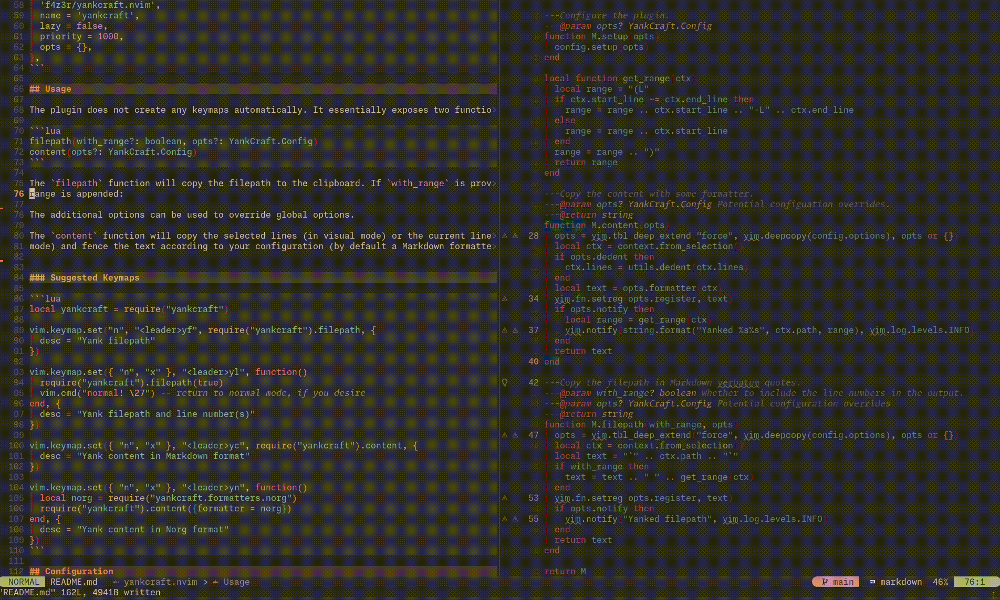

<div align="center">

<a href="https://github.com/f4z3r/yankcraft.nvim/archive/main.zip"></a>

# yankcraft.nvim


### Transform Neovim selections into shareable clipboard content.

[Features](#features) |
[Installation](#installation) |
[Usage](#usage) |
[Configuration](#configuration)

<hr />
</div>

> [!NOTE]
> Credits: this is started a fork from
> [context-yank.nvim](https://github.com/ymtdzzz/context-yank.nvim) as it provided the baseline for
> clipboard handling and similar features to what I wanted to achieve. The goal of this repository
> is diverging from context-yank.nvim though. It strives to provide different formatting options for
> various target systems.

## Features

This is essentially a quality of life wrapper around yank operations. It can have many use cases.
Some of the ones that I like the most:

- Quickly copy a filepath and line number reference so I can paste them into an agent prompt to
  reference some code.
- Copy a code block and wrap it in Markdown fences to send via a messaging app to someone.
- Copy a code block and wrap it in [Norg](https://github.com/nvim-neorg/norg-specs) fences to paste
  in my [Neorg](https://github.com/nvim-neorg/neorg) setup.

Here is a short example copying a file reference including line range to the clipboard, and an
example copying a code block into markdown format:



Currently, the following formatters are directly supported by this plugin:

- Markdown,
- AsciiDoc,
- reStructuredText,
- filepath,
- filepath with a line range,
- Jira,
- Confluence Wiki,
- Org Mode,
- LaTex (listings),
- LaTex (minted),
- Norg,
- plain text

See [`docs/formatters.md`](./docs/formatters.md) for a sample output of the formatters.

I will add more in the future. You you want another one, simply open an issue or a PR.

This plugin is best used when combined with a yank ring such as
[`yanky.nvim`](https://github.com/gbprod/yanky.nvim). Additionally, I recommend using
[`gitlinker.nvim`](https://github.com/ruifm/gitlinker.nvim) if you want to share links to code
hosted somewhere.

## Installation

Install via your favourite package manager:

[vim-plug](https://github.com/junegunn/vim-plug)

```vim
Plug 'f4z3r/yankcraft.nvim'
```

[packer](https://github.com/wbthomason/packer.nvim)

```lua
use 'f4z3r/yankcraft.nvim'
```

[lazy](https://github.com/folke/lazy.nvim)

```lua
{
  'f4z3r/yankcraft.nvim',
  name = 'yankcraft',
  opts = {},
},
```

[Nix package](https://search.nixos.org/packages?channel=unstable&show=vimPlugins.yankcraft-nvim&from=0&size=50&sort=relevance&type=packages&query=yankcraft-nvim)
with [home-manager](https://github.com/nix-community/home-manager)

```nix
programs.neovim = {
  enable = true;
  # ...
  plugins = with pkgs.vimPlugins; [
    # ...
    {
      type = "lua";
      plugin = yankcraft-nvim;
      config = ''require('yankcraft').setup()'';
    }
  ];
};
```

## Usage

The plugin does not create any keymaps automatically. It essentially exposes a single function:

```lua
copy(opts?: YankCraft.Config)
```

You can pass various formatters using the options. These are identical to the configuration used
in the `setup` function. Typically you might want to provide a formatter. For instance, to get
the filepath with a line range:

```lua
local fmtr = require("yankcraft.formatters.filepath_with_line_range")
require("yankcraft").copy({formatter = fmtr})
```

This will result in the following:

```
`lua/yankcraft/init.lua` (L39-L42)
```

By default, the configured default formatter from the `setup` function will be used, which formats
the code block as Markdown:

````
```lua
function M.content(opts)
  opts = vim.tbl_deep_extend("force", vim.deepcopy(config.options), opts or {})
  local ctx = context.from_selection()
  local text = opts.formatter(ctx)
  vim.fn.setreg(opts.register, text)
  if config.options.notify then
    local range = get_range(ctx)
    vim.notify(string.format("Yanked %s%s", ctx.path, range), vim.log.levels.INFO)
  end
  return text
end
```
````

See [`docs/formatters.md`](./docs/formatters.md) for the sample output of all supported formatters.

### Suggested Keymaps

```lua
local yankcraft = require("yankcraft")

vim.keymap.set({ "n", "x" }, "<leader>yf", function()
  local formatter = require("yankcraft.formatters.filepath")
  require("yankcraft").copy({formatter = formatter})
  vim.cmd("normal! \27") -- return to normal mode, if you desire
end, {
  desc = "Yank filepath"
})

vim.keymap.set({ "n", "x" }, "<leader>yl", function()
  local formatter = require("yankcraft.formatters.filepath_with_line_range")
  require("yankcraft").copy({formatter = formatter})
end, {
  desc = "Yank filepath and line number(s)"
})

-- this assumes you have not setup another default formatter via `setup`
vim.keymap.set({ "n", "x" }, "<leader>ym", require("yankcraft").copy, {
  desc = "Yank content in Markdown format"
})

vim.keymap.set({ "n", "x" }, "<leader>yn", function()
  local norg = require("yankcraft.formatters.norg")
  require("yankcraft").copy({formatter = norg})
end, {
  desc = "Yank content in Norg format"
})

-- You can also define your custom formatter and pass it directly here.
-- See "Building a Custom Formatter"
```

## Configuration

Defaults:

```lua
require("yankcraft").setup({
  register = "+",       -- register to yank into (system clipboard)
  path_style = "auto",  -- "auto" (git root -> cwd) | "relative" (cwd) | "absolute"
  notify = true,        -- notify on successful yank
  dedent = true,        -- whether to remove the common indents on code content copies
  formatter = nil,      -- your custom default formatter function, markdown by default
})
```

### Building a Custom Formatter

You can build a custom formatter if it is not provided by the project (or feel free to open a PR). This
can be done by providing a function with the following format:

```lua
fun(ctx: YankCraft.Context): string
```

Where `YankCraft.Context` provides the following fields:

```lua
---@class YankCraft.Context
---@field path string Display path of the buffer.
---@field filetype string Filetype used as the code-fence language ("" when unknown).
---@field selection_type YankCraft.SelectionType The type of selection that was performed.
---@field start_line integer 1-based start line.
---@field end_line integer 1-based end line.
---@field start_col integer? 1-based start column (if visual selection).
---@field end_col integer? 1-based end column (if visual selection).
---@field lines string[] Collected buffer lines.

---@alias YankCraft.SelectionType
---| "char"
---| "line"
---| "block"
```

See [`lua/yankcraft/formatters/norg.lua`](./lua/yankcraft/formatters/norg.lua) for an example implementation
of a formatter that dedents the lines of text and adds a `@code <lang>` start and an `@end` end fence.

Such a function can then be given either as a default formatter in the configuration, or when calling
the `copy` function directly (see [Suggested Keymaps](#suggested-keymaps) for an example).

## Testing

Use the following command to run the tests:

```bash
make test
```

## License

MIT
